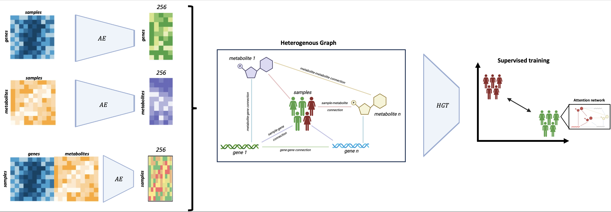

# PRAMIGO: A Heterogenous Graph Transformer approach to target multi-omic integrated programs

<p align="center">
  
</p>

## 📥 Setup & Installation

### 1. Clone PRAMIGO Locally

```bash

git clone https://github.com/iclemente99/PRAMIGO

```

### 2. HGT Environment

OPTION 1 - Create conda HGT environment

```bash

conda env create -f env/hgt_env.yml
conda activate hgt_env

```

OPTION 2 - Create uv HGT environment

```bash

curl -LsSf https://astral.sh/uv/install.sh | sh # Just once to use uv
uv venv hgt_env
source hgt_env/bin/activate
uv pip install -r env/hgt_env.txt

```

## 🚀 Usage

The main function is src/biomix_hgt.py - this is the one you'll need to run and you can run it on your terminal as:

```bash
python src/biomix_hgt.py \
  --metadata_path "./data/EGA/Metadata/EGAS00001001746_metadata_CLL.tsv" \
  --omic1_path "./data/EGA_omic1.csv" \
  --omic2_path "./data/EGA_omic2.csv" \
  --result_dir "./data/EGA_biomix"
```

This function loads the data, trains the model, saves the results and creates the visualization plots for the user.

## 🎯 Important considerations

- You can see that the input are paths to the files.
- Metadata is expected to be a TSV that contains at least "ID" column with the samples identifiers and "CONDITION" with the condition groups as it's in MTB and EGA datasets.
- Omic1 and Omic2 are expected to be CSV that contains the column "ID" on the left with the samples identifiers. THESE SHOULD BE THE FILTERED MATRICES. The function won't filter.
- Results_dir will save all the results with in different folders inside it with the embeddings, the trained model, visualization plots and so on.

## ✍️ Citation & Acknowledgements

This work was developed at LBAI-UBO. Please cite accordingly if used in academic research.

## 🖥️ Maintainers

Iñigo Clemente Larramendi — inigo.clementelarramendi@univ-brest.fr

